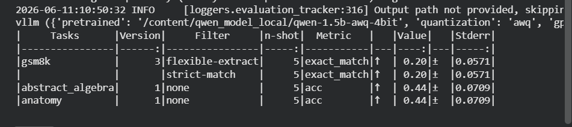
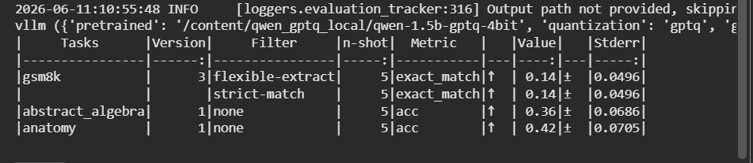

# Qwen-1.5B Quantization and vLLM Benchmark 🚀

NOTE- I compared AWQ and GPTQ on Qwen2.5-1.5B. AWQ achieved higher downstream accuracy on GSM8K and MMLU, while GPTQ achieved marginally lower perplexity. However, the perplexity difference was only about 0.1%, and the benchmark sample sizes were too small for a statistically strong conclusion. Additionally, my GPTQ configuration used desc_act=False, which likely disadvantaged GPTQ. Therefore I would not claim AWQ is universally better based on these results.

This repository contains Python scripts to locally quantize the `Qwen/Qwen2.5-1.5B` model into **4-bit GPTQ** and **4-bit AWQ** formats. It also includes comprehensive benchmarking tools to test the throughput of these models using **vLLM** and evaluate their accuracy using **lm-eval**.

*📝 **Important Note on Model Format:** The quantized models generated by the scripts in this repository are compressed and saved in the **`.xzip` format** to save space. You must extract them before running the evaluation or throughput benchmarks.*

## 📁 Repository Structure

* `scripts/model_quantize.py`: Script to download the base Qwen model, apply WikiText-2 calibration, and save both GPTQ and AWQ 4-bit versions as `.xzip` archives.
* `scripts/model_quantize_benchmark.py`: Python script to load the quantized models into a vLLM engine, verify Marlin kernel activation, and test raw token generation throughput (tokens/sec).
* `scripts/run_evaluations.sh` / `run_evaluations.py`: Automated scripts containing the `lm_eval` harness commands used to evaluate the quantized models on specific datasets (MMLU, GSM8k, WikiText).
* `requirements.txt`: Dependencies required to run the code.


## 🛠️ Installation & Setup

1. Clone this repository:
   ```bash
   git clone [https://github.com/Sid1396-byte/qwen-quantization.git](https://github.com/Sid1396-byte/qwen-quantization.git)
   cd qwen-quantization

   ---

## 📈 Benchmark Results

Here are the evaluation results for both quantization methods:

### AWQ Evaluation
**MMLU & GSM8k Results:**


**Perplexity (WikiText):**


### GPTQ Evaluation
**MMLU & GSM8k Results:**


**Perplexity (WikiText):**


---
